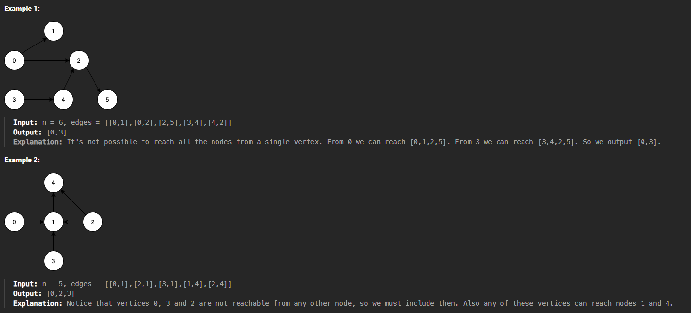

# Questão - 1557

## Minimum Number of Vertices to Reach All Nodes

Given a directed acyclic graph, with `n` vertices numbered from `0` to `n-1`, and an array `edges` where `edges[i] = [fromi, toi]` represents a directed edge from node `fromi` to node `toi`.

Find the smallest set of vertices from which all nodes in the graph are reachable. It's guaranteed that a unique solution exists.

Notice that you can return the vertices in any order.

## Exemplos



## Solved


## Código

```python
class Solution:
    def findSmallestSetOfVertices(self, n: int, edges: List[List[int]]) -> List[int]:
        has_incoming = set()

        for from_node, to_node in edges:
            has_incoming.add(to_node)
            
        return [node for node in range(n) if node not in has_incoming]
```