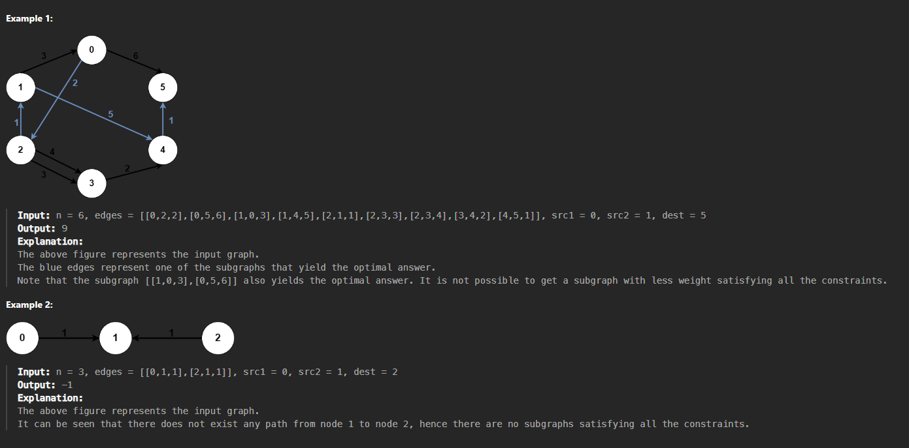

# Questão - 2203

## Minimum Weighted Subgraph With the Required Paths

You are given an integer `n` denoting the number of nodes of a weighted directed graph. The nodes are numbered from `0` to `n - 1`.

You are also given a 2D integer array `edges` where `edges[i] = [fromi, toi, weighti]` denotes that there exists a directed edge from `fromi` to `toi` with weight `weighti`.

Lastly, you are given three distinct integers `src1`, `src2`, and `dest` denoting three distinct nodes of the graph.

Return the minimum weight of a subgraph of the graph such that it is possible to reach `dest` from both `src1` and `src2` via a set of edges of this subgraph. In case such a subgraph does not exist, return `-1`.

A subgraph is a graph whose vertices and edges are subsets of the original graph. The weight of a subgraph is the sum of weights of its constituent edges.

## Exemplos



## Solved


## Código

```python
import heapq

class Solution:
    def minimumWeight(self, n: int, edges: List[List[int]], src1: int, src2: int, dest: int) -> int:
        def dijkstra(n, edges, src):
            dist = [float('inf')] * n
            pq = [[0, src]]
            dist[src] = 0

            while pq:
                w, u = heapq.heappop(pq)

                if w > dist[u]:
                    continue
            
                for v, weight in edges[u]:

                    if dist[v] > dist[u] + weight:
                        dist[v] = dist[u] + weight
                        heapq.heappush(pq, [dist[v], v])
            return dist

        adj = [[] for _ in range(n)]
        adjC = [[] for _ in range(n)]

        for fro, to, we in edges:
            adj[fro].append((to, we))
            adjC[to].append((fro, we))

        dist1 = dijkstra(n, adj, src1)
        dist2 = dijkstra(n, adj, src2)
        dist3 = dijkstra(n, adjC, dest)

        res = float('inf')
        for i in range(n):
            if dist1[i] < res and dist2[i] < res and dist3[i] < res:
                res = min(res, dist1[i] + dist2[i] + dist3[i])

        if res < float('inf'): return res

        return -1
```