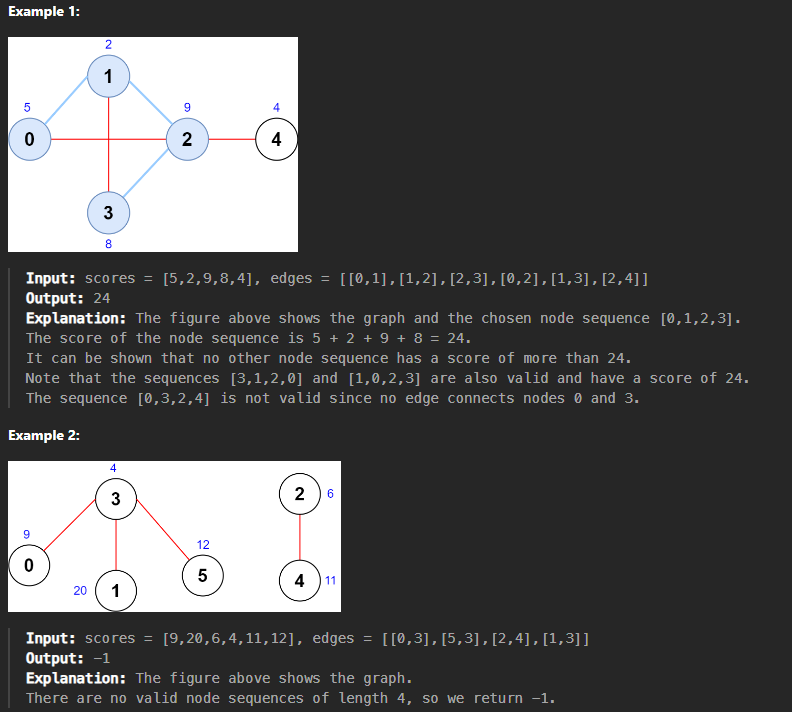

# Questão - 2242

## Maximum Score of a Node Sequence

There is an undirected graph with `n` nodes, numbered from `0` to `n - 1`.

You are given a 0-indexed integer array `scores` of length `n` where `scores[i]` denotes the score of node `i`. You are also given a 2D integer array `edges` where `edges[i] = [ai, bi]` denotes that there exists an undirected edge connecting nodes `ai` and `bi`.

A node sequence is valid if it meets the following conditions:

There is an edge connecting every pair of adjacent nodes in the sequence.
No node appears more than once in the sequence.
The score of a node sequence is defined as the sum of the scores of the nodes in the sequence.

Return the maximum score of a valid node sequence with a length of `4`. If no such sequence exists, return `-1`.

## Exemplos



## Solved


## Código

``` python
class Solution:
    def maximumScore(self, scores: List[int], edges: List[List[int]]) -> int:
        n = len(scores)
        graph = [[] for _ in range(n)]

        for u, v in edges:
            graph[u].append(v)
            graph[v].append(u)

        top_neighbors = [[] for _ in range(n)]
        for u in range(n):
            neighbors = graph[u]
            top_neighbors[u] = sorted(neighbors, key=lambda x: -scores[x])[:3]

        max_score = -1

        for u, v in edges:
            for a in top_neighbors[u]:
                if a == v:
                    continue
                for b in top_neighbors[v]:
                    if b == u or b == a:
                        continue
                    max_score = max(max_score, scores[a] + scores[u] + scores[v] + scores[b])

        return max_score
```