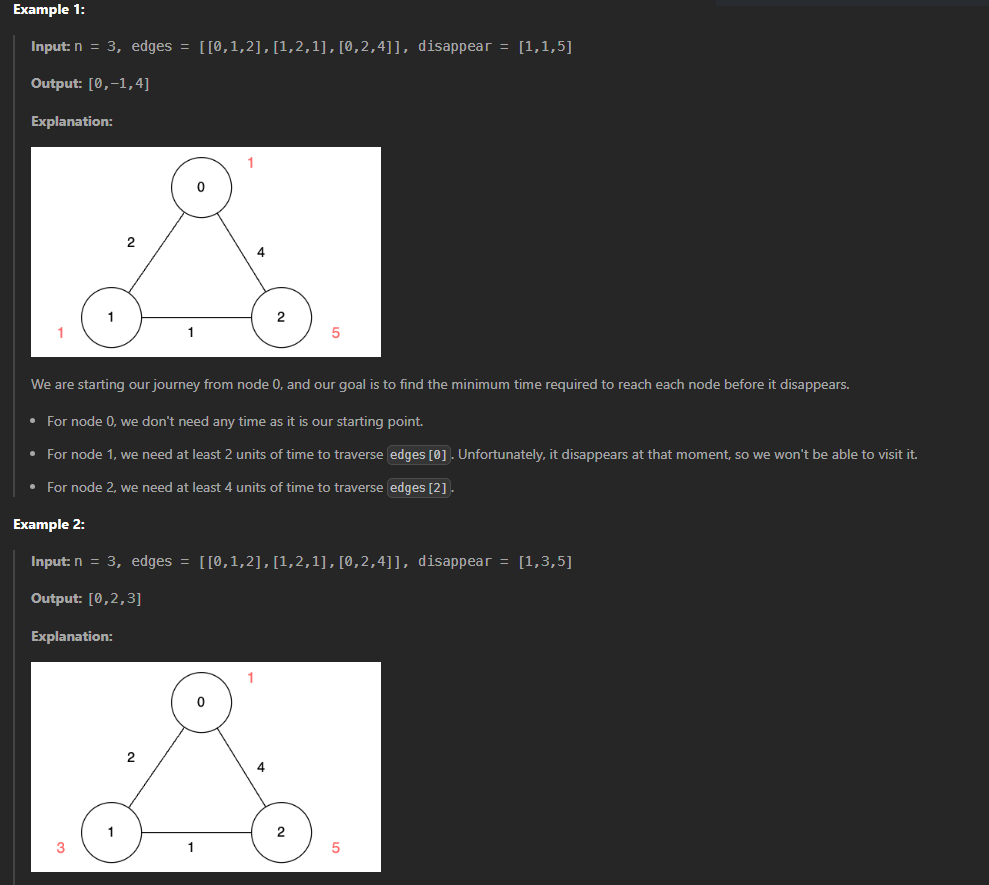

# Questão - 3112

## Minimum Time to Visit Disappearing Nodes

There is an undirected graph of `n` nodes. You are given a 2D array `edges`, where `edges[i] = [ui, vi, lengthi]` describes an edge between node `ui` and node `vi` with a traversal time of `lengthi` units.

Additionally, you are given an array `disappear`, where `disappear[i]` denotes the time when the node `i` disappears from the graph and you won't be able to visit it.

Note that the graph might be disconnected and might contain multiple edges.

Return the array answer, with answer[i] denoting the minimum units of time required to reach node `i` from node 0. If node `i` is unreachable from node 0 then `answer[i]` is `-1`.`

## Exemplos



## Solved


## Código

```python
import heapq

class Solution:
    def minimumTime(self, n: int, edges: List[List[int]], disappear: List[int]) -> List[int]:
        graph = [[] for _ in range(n)]

        for u, v, w in edges:
            graph[u].append([v, w])
            graph[v].append([u, w])

        dist = [float('inf')] * n
        dist[0] = 0
        heap = [(0, 0)]

        while heap:
            time, node = heapq.heappop(heap)


            if time > dist[node]:
                continue

            if time >= disappear[node]:
                continue

            for neighbor, weight in graph[node]:
                new_time = time + weight

                if new_time < dist[neighbor] and new_time < disappear[neighbor]:
                    dist[neighbor] = new_time
                    heapq.heappush(heap, (new_time, neighbor))

        return [t if t != float('inf') else -1 for t in dist]

```